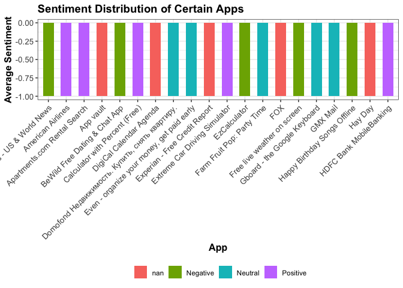

Data Science Test
================
2023-06-15

# The purpose of this README is to show my solutions to the Data science 871 exam.

The first thing i did is loadpackages that i may need

``` r
suppressMessages(library(tidyverse)) 
suppressMessages(library(tinytex))
suppressMessages(library(viridis))
suppressMessages(library(wordcloud))
suppressMessages(library(RColorBrewer))
```

# Question 1

``` r
source("/Users/sahilbhugwan/Downloads/Data science/21075492/Q1/code/Q1.R")
```

Comparing average deaths in Africa to Europe

``` r
AVD
```

<!-- -->

Testing and positivity rates in Africa compared to other regions

``` r
TP
```

<!-- -->

healthcare capacity : ICU patients

``` r
HCC
```

<!-- -->

Perform analysis based on life expectancy

``` r
LE
```

<!-- -->

Hospitalization Facilities vs. ICU Admissions

``` r
HFvICU
```

<!-- -->

Impact of intervention

``` r
SI
```

<!-- -->

# Question 2

``` r
source("/Users/sahilbhugwan/Downloads/Data science/21075492/Q2/code/Q2.R")
```

Line chart for Max tempretures over the years

``` r
 print(MT)
```

<!-- -->

scatter plot for temperature vs. precipitation

``` r
print(TemP)
```

<!-- --> Number of
Days max Temp less than 21.1 degrees Celsius

``` r
L21 
```

<!-- -->

Number of days with maximum temperature greater than 32.2 degrees

``` r
M32
```

<!-- -->

# Question 3

Here we will be comparing two of the longst bands that being Coldplay
and Metallica

``` r
source("/Users/sahilbhugwan/Downloads/Data science/21075492/Q3/code/Q3.R")
```

Coldplay popular songs

``` r
PS(CP)
```

    ## Selecting by total_popularity

<!-- -->

    ## $cold_pop
    ## # A tibble: 10 × 16
    ##    name        durat…¹ release_…² album…³ expli…⁴ popul…⁵ acous…⁶ dance…⁷ energy
    ##    <chr>         <dbl> <date>     <chr>   <lgl>     <dbl>   <dbl>   <dbl>  <dbl>
    ##  1 A Head Ful…    294. 2018-12-07 Love i… FALSE        14 0.0948    0.307  0.92 
    ##  2 A Head Ful…    224. 2015-12-04 A Head… FALSE        70 0.0021    0.449  0.92 
    ##  3 Hymn for t…    258. 2015-12-04 A Head… FALSE        86 0.211     0.491  0.693
    ##  4 Adventure …    264. 2015-12-04 A Head… FALSE        80 0.00205   0.638  0.924
    ##  5 A Head Ful…    224. 2015-12-04 A Head… FALSE        18 0.0021    0.449  0.92 
    ##  6 Hymn for t…    258. 2015-12-04 A Head… FALSE        26 0.211     0.491  0.693
    ##  7 Adventure …    264. 2015-12-04 A Head… FALSE        23 0.00205   0.638  0.924
    ##  8 Viva La Vi…    242. 2008-11-24 Viva L… FALSE        34 0.0954    0.486  0.617
    ##  9 Viva La Vi…    242. 2008-06-19 Viva L… FALSE        75 0.0954    0.486  0.617
    ## 10 Yellow         267. 2000-07-10 Parach… FALSE        91 0.00239   0.429  0.661
    ## # … with 7 more variables: instrumentalness <dbl>, liveness <dbl>,
    ## #   loudness <dbl>, speechiness <dbl>, tempo <dbl>, valence <dbl>,
    ## #   album_release <date>, and abbreviated variable names ¹​duration,
    ## #   ²​release_date, ³​album_name, ⁴​explicit, ⁵​popularity, ⁶​acousticness,
    ## #   ⁷​danceability
    ## 
    ## $order
    ##  [1] "Parachutes"                               
    ##  [2] "A Rush of Blood to the Head"              
    ##  [3] "A Head Full of Dreams"                    
    ##  [4] "Ghost Stories"                            
    ##  [5] "Music Of The Spheres"                     
    ##  [6] "X&Y"                                      
    ##  [7] "Live in Buenos Aires"                     
    ##  [8] "Mylo Xyloto"                              
    ##  [9] "Live 2012"                                
    ## [10] "Ghost Stories Live 2014"                  
    ## [11] "Viva La Vida or Death and All His Friends"
    ## [12] "Live 2003"                                
    ## [13] "LeftRightLeftRightLeft (Live)"            
    ## [14] "Viva La Vida (Prospekts March Edition)"   
    ## [15] "Everyday Life"                            
    ## [16] "A Head Full of Dreams Tour Edition"       
    ## [17] "Love in Tokyo"

Metallica popular songs

``` r
PS(metallica)
```

    ## Selecting by total_popularity

<!-- -->

    ## $cold_pop
    ## # A tibble: 10 × 15
    ##    name        album…¹ durat…² popul…³ release_…⁴ dance…⁵ energy loudn…⁶ speec…⁷
    ##    <chr>       <chr>     <dbl>   <dbl> <date>       <dbl>  <dbl>   <dbl>   <dbl>
    ##  1 Turn The P… Garage…  366400      62 1998-11-24   0.422  0.818   -3.94  0.0319
    ##  2 Whiskey In… Garage…  304893      67 1998-11-24   0.511  0.972   -3.75  0.0413
    ##  3 Turn The P… Garage…  366467      66 1998-01-01   0.426  0.813   -3.96  0.0318
    ##  4 Whiskey In… Garage…  304693      76 1998-01-01   0.511  0.97    -3.72  0.0414
    ##  5 One (Remas… ...And…  446146      51 1988-09-07   0.438  0.687   -9.15  0.0619
    ##  6 One (Remas… ...And…  446146      72 1988-09-07   0.438  0.687   -9.15  0.0619
    ##  7 One         And Ju…  446146      50 1988-08-25   0.439  0.691   -9.16  0.0608
    ##  8 One         ...And…  447440      75 1988-08-25   0.437  0.695   -9.45  0.0617
    ##  9 For Whom T… Ride T…  309973      73 1984-07-27   0.512  0.86    -6.14  0.0703
    ## 10 For Whom T… Ride T…  309973      54 1984-07-27   0.512  0.86    -6.14  0.0703
    ## # … with 6 more variables: acousticness <dbl>, instrumentalness <dbl>,
    ## #   liveness <dbl>, valence <dbl>, tempo <dbl>, album_release <date>, and
    ## #   abbreviated variable names ¹​album_name, ²​duration_ms, ³​popularity,
    ## #   ⁴​release_date, ⁵​danceability, ⁶​loudness, ⁷​speechiness
    ## 
    ## $order
    ##  [1] "72 Seasons"                                                 
    ##  [2] "Metallica"                                                  
    ##  [3] "Metallica (Remastered)"                                     
    ##  [4] "Master Of Puppets (Remastered)"                             
    ##  [5] "...And Justice For All"                                     
    ##  [6] "Kill Em All (Remastered)"                                   
    ##  [7] "...And Justice for All (Remastered)"                        
    ##  [8] "Ride The Lightning (Remastered)"                            
    ##  [9] "Death Magnetic"                                             
    ## [10] "Garage Inc."                                                
    ## [11] "HardwiredTo Self-Destruct"                                  
    ## [12] "Load"                                                       
    ## [13] "And Justice for All (Remastered)"                           
    ## [14] "Metallica (Remastered 2021)"                                
    ## [15] "Reload"                                                     
    ## [16] "Garage, Inc."                                               
    ## [17] "HardwiredTo Self-Destruct (Deluxe)"                         
    ## [18] "Metallica Through The Never (Music From The Motion Picture)"
    ## [19] "St. Anger"                                                  
    ## [20] "S&M2"                                                       
    ## [21] "S&M"                                                        
    ## [22] "Live Sh*t: Binge & Purge (Live In Mexico City)"             
    ## [23] "Helping HandsLive & Acoustic At The Masonic"                
    ## [24] "Live S**t: Binge & Purge"                                   
    ## [25] "Ride The Lightning (Deluxe Remaster)"                       
    ## [26] "Some Kind Of Monster"                                       
    ## [27] "Ride The Lightning (Deluxe / Remastered)"                   
    ## [28] "Helping Hands...Live & Acoustic at The Masonic"             
    ## [29] "Live In Brazil (1993 \x93 2017)"                            
    ## [30] "Kill Em All (Deluxe / Remastered)"                          
    ## [31] "Metallica (Remastered Deluxe Box Set)"                      
    ## [32] "Lulu"                                                       
    ## [33] "Kill Em All (Deluxe Remaster)"                              
    ## [34] "Master of Puppets (Remastered Deluxe Box Set)"              
    ## [35] "And Justice for All (Remastered Deluxe Box Set)"            
    ## [36] "...And Justice for All (Remastered Deluxe Box Set)"         
    ## [37] "Some Kind Of Monster (Live)"                                
    ## [38] "Live In Chile (1993 \x93 2017)"                             
    ## [39] "Master Of Puppets (Deluxe Box Set / Remastered)"            
    ## [40] "Live In Argentina (1993 \x93 2017)"                         
    ## [41] "Six Feet Down Under Part 2"                                 
    ## [42] "Six Feet Down Under"

Comparing song Durations

``` r
print(DS)
```

<!-- -->

Correlation matrix based on danceability, energy, instrumentalness,
liveness, loudness, speechiness & tempo

``` r
corrplot(CMCP, method = "color") #Coldplay
```

<!-- -->

``` r
corrplot::corrplot(CMM, method = "color", col = colorRampPalette(c("blue", "white", "red"))(10)) #Metallica
```

<!-- -->

# Question 4

What works in Streaming service if SU lauches its own one The full pdf
report can be found in Q4 folder.

``` r
source("/Users/sahilbhugwan/Downloads/Data science/21075492/Q4/code/Q4.R")
```

<!-- --><!-- -->

    ##    age_certification num_titles
    ## 1                  G       1456
    ## 2              NC-17        258
    ## 3                 PG       5134
    ## 4              PG-13      11508
    ## 5                  R      15853
    ## 6              TV-14       3518
    ## 7               TV-G        377
    ## 8              TV-MA       6581
    ## 9              TV-PG        944
    ## 10              TV-Y        299
    ## 11             TV-Y7        667

The first thing to look as is netfix decline

``` r
print(Trends) 
```

<!-- -->

Next i look at the content on netflix and it is clear the movies
dominate

``` r
Pie 
```

<!-- -->

I then looked at what are the most popular genres on Netflix and
illustrated it using a word cloud

``` r
generate_wordcloud(genre_counts)
```

<!-- -->

I also looked at which stars appear most on netflix

``` r
plot_top_names(merged_data)
```

<!-- -->

Therefore if SU wants to launch its own streamig service it should look
to produce movies that are drama or comdey based and include a high
profile actor/actress.

# Question 5

Here i will be looking at app size

``` r
source("/Users/sahilbhugwan/Downloads/Data science/21075492/Q5/code/Q5.R")
```

App ratings

``` r
APR
```

<!-- -->

App ratings per content

``` r
Ratings
```

<!-- -->

App rating compared to last updated

``` r
ARLU
```

<!-- -->

App Size compared to rating

``` r
ARS
```

<!-- -->

User Reviews

``` r
wordcloud(term_frequency$word, term_frequency$n, scale = c(5, 0.5), max.words = 100, random.order = FALSE,
          color = brewer.pal(8, "Set2"))
```

<!-- -->

App Sentiment

``` r
SDA
```

<!-- -->
