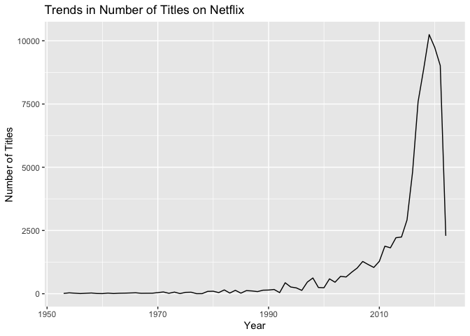

Data Science Test
================
2023-06-16

# The purpose of this README is to show my solutions to the Data science 871 exam.

The first thing i did is loadpackages that i may need

``` r
suppressMessages(library(tidyverse)) 
suppressMessages(library(tinytex))
suppressMessages(library(viridis))
suppressMessages(library(wordcloud))
suppressMessages(library(RColorBrewer))
```

The next thing I did was create this folder, specifically the
21075492.Rproj and corresponding folders, as well as the sub-directories
for each question. These also have their own projects. Within those
folders you will find, amongst other things, a) pdfs with the answers to
the relevant questions, b) a code folder.

# Question 1

This question was with regards to the COVID-19 Pandemic. I answered this
question in three parts

``` r
source("/Users/sahilbhugwan/Downloads/Data science/21075492/Q1/code/Q1.R")
```

First: i looked at how Africa countries did compared to different
regions. My thinking was i would look at the average deaths in Africa
compared to Europe. This is because Africa is generally considered to be
a third world country compared that to most European countries.However
from the graph below it is clear that Africa had on average less deaths
than Europe.

Comparing average deaths in Africa to Europe

``` r
AVD
```

<!-- -->

Next i looked Testing and positivity rates in Africa compared to other
regions. The percent positive will be high if the number of positive
tests is too high, or if the number of total tests is too low. A higher
percent positive suggests higher transmission and that there are likely
more people with coronavirus in the community who haven’t been tested
yet.

``` r
TP
```

<!-- -->

Next i looked at healthcare capacity to ICU patients. This is because
when COVID hit many hospitals couldn’t keep up with the increase in ICU
patients which meant they lacked the necssary equiment.

``` r
HCC
```

<!-- -->

The second part: i looked at to see that if a person got COVID would
they be at risk. It is clear that those that the older people where more
at risk. This is due to the fact that they have weaker immmune systems.

``` r
LE
```

<!-- -->

The third part: i looked at different regions hospitalization
facilities, and whether this led or lagged ICU admissions.

i decided to look at Hospitalization Facilities vs. ICU Admissions this
because i wanted to see that as COVID got worse and spread more.
Hospitals would have had to increase the facilities are make
althernative arrangements to deal with the increased supply of sick
people.

``` r
HFvICU
```

<!-- -->

As an interesting analysis i thought i would do a stringency index. The
stringency index is a measure that quantifies the strictness of
government policies or regulations in response to various events or
crises such as COVID-19. The stringency index takes into account a range
of policy indicators, such as school closures, travel restrictions,
public event cancellations, and social distancing measures, among
others. By combining these indicators into a single index, it provides a
measure of the overall stringency of government actions in a particular
region or country.

``` r
SI
```

<!-- -->

# Question 2

In order to challenge my friend’s claim about the weather in the mid
parts of England, I have decided to conduct an analysis using weather
data from London.

``` r
source("/Users/sahilbhugwan/Downloads/Data science/21075492/Q2/code/Q2.R")
```

I first starting by showing the maximum temperature trend. The graph
below shows where UK at heatwaves as well well as the general trend of
the average temperature.

``` r
 print(MT)
```

<!-- -->

Given that it is common knowledge that is rains a lot in the UK and from
the previous graph we can see the average trend of temperatures was
relatively low. I decided to do a scatter plot for temperature
vs. precipitation. (for more analysis on the precipitation i do have a
graph for it in my Q2 pdf)

``` r
print(TemP)
```

<!-- -->

Next given that the temperature is always low i wanted to see on the in
a year the number of days the max temperature less than 21.1 degrees
Celsius.

``` r
L21 
```

<!-- -->

Lastly my friend believes that it is mostly sunny however i wanted to
see how many days in the year is the temperature above 32 degrees. It is
extremely rare that they have more than two days. (I do have a graph in
my Q2 pdf that shows the distribution of Sun duration for the year)

``` r
M32
```

<!-- -->

# Question 3

Give that Coldplay and Metallica are one of the most famous bands over
time i wanted to see the longevity and musical progression of them

``` r
source("/Users/sahilbhugwan/Downloads/Data science/21075492/Q3/code/Q3.R")
```

I first decided to look at Coldplay in my report (in Q3 folder ) it is
clear that they are most popular from 2010 onwards. I then decided to do
a graph to show there most popular songs and which album it is from. It
is clear that after 2016 that is when Coldplay hit it speak with it most
popular songs. (I also have a table of there most popular song an i am
aware that my table didnt come out looking nice)

``` r
PS(CP)
```

    ## Selecting by total_popularity

<!-- -->

    ## $cold_pop
    ## # A tibble: 10 × 16
    ##    name        durat…¹ release_…² album…³ expli…⁴ popul…⁵ acous…⁶ dance…⁷ energy
    ##    <chr>         <dbl> <date>     <chr>   <lgl>     <dbl>   <dbl>   <dbl>  <dbl>
    ##  1 A Head Ful…    294. 2018-12-07 Love i… FALSE        14 0.0948    0.307  0.92 
    ##  2 A Head Ful…    224. 2015-12-04 A Head… FALSE        70 0.0021    0.449  0.92 
    ##  3 Hymn for t…    258. 2015-12-04 A Head… FALSE        86 0.211     0.491  0.693
    ##  4 Adventure …    264. 2015-12-04 A Head… FALSE        80 0.00205   0.638  0.924
    ##  5 A Head Ful…    224. 2015-12-04 A Head… FALSE        18 0.0021    0.449  0.92 
    ##  6 Hymn for t…    258. 2015-12-04 A Head… FALSE        26 0.211     0.491  0.693
    ##  7 Adventure …    264. 2015-12-04 A Head… FALSE        23 0.00205   0.638  0.924
    ##  8 Viva La Vi…    242. 2008-11-24 Viva L… FALSE        34 0.0954    0.486  0.617
    ##  9 Viva La Vi…    242. 2008-06-19 Viva L… FALSE        75 0.0954    0.486  0.617
    ## 10 Yellow         267. 2000-07-10 Parach… FALSE        91 0.00239   0.429  0.661
    ## # … with 7 more variables: instrumentalness <dbl>, liveness <dbl>,
    ## #   loudness <dbl>, speechiness <dbl>, tempo <dbl>, valence <dbl>,
    ## #   album_release <date>, and abbreviated variable names ¹​duration,
    ## #   ²​release_date, ³​album_name, ⁴​explicit, ⁵​popularity, ⁶​acousticness,
    ## #   ⁷​danceability
    ## 
    ## $order
    ##  [1] "Parachutes"                               
    ##  [2] "A Rush of Blood to the Head"              
    ##  [3] "A Head Full of Dreams"                    
    ##  [4] "Ghost Stories"                            
    ##  [5] "Music Of The Spheres"                     
    ##  [6] "X&Y"                                      
    ##  [7] "Live in Buenos Aires"                     
    ##  [8] "Mylo Xyloto"                              
    ##  [9] "Live 2012"                                
    ## [10] "Ghost Stories Live 2014"                  
    ## [11] "Viva La Vida or Death and All His Friends"
    ## [12] "Live 2003"                                
    ## [13] "LeftRightLeftRightLeft (Live)"            
    ## [14] "Viva La Vida (Prospekts March Edition)"   
    ## [15] "Everyday Life"                            
    ## [16] "A Head Full of Dreams Tour Edition"       
    ## [17] "Love in Tokyo"

I then did the same for metallica, however one key difference is that
metallica was more popular during Metallica popular songs during that
late 1980s.

``` r
PS(metallica)
```

    ## Selecting by total_popularity

<!-- -->

    ## $cold_pop
    ## # A tibble: 10 × 15
    ##    name        album…¹ durat…² popul…³ release_…⁴ dance…⁵ energy loudn…⁶ speec…⁷
    ##    <chr>       <chr>     <dbl>   <dbl> <date>       <dbl>  <dbl>   <dbl>   <dbl>
    ##  1 Turn The P… Garage…  366400      62 1998-11-24   0.422  0.818   -3.94  0.0319
    ##  2 Whiskey In… Garage…  304893      67 1998-11-24   0.511  0.972   -3.75  0.0413
    ##  3 Turn The P… Garage…  366467      66 1998-01-01   0.426  0.813   -3.96  0.0318
    ##  4 Whiskey In… Garage…  304693      76 1998-01-01   0.511  0.97    -3.72  0.0414
    ##  5 One (Remas… ...And…  446146      51 1988-09-07   0.438  0.687   -9.15  0.0619
    ##  6 One (Remas… ...And…  446146      72 1988-09-07   0.438  0.687   -9.15  0.0619
    ##  7 One         And Ju…  446146      50 1988-08-25   0.439  0.691   -9.16  0.0608
    ##  8 One         ...And…  447440      75 1988-08-25   0.437  0.695   -9.45  0.0617
    ##  9 For Whom T… Ride T…  309973      73 1984-07-27   0.512  0.86    -6.14  0.0703
    ## 10 For Whom T… Ride T…  309973      54 1984-07-27   0.512  0.86    -6.14  0.0703
    ## # … with 6 more variables: acousticness <dbl>, instrumentalness <dbl>,
    ## #   liveness <dbl>, valence <dbl>, tempo <dbl>, album_release <date>, and
    ## #   abbreviated variable names ¹​album_name, ²​duration_ms, ³​popularity,
    ## #   ⁴​release_date, ⁵​danceability, ⁶​loudness, ⁷​speechiness
    ## 
    ## $order
    ##  [1] "72 Seasons"                                                 
    ##  [2] "Metallica"                                                  
    ##  [3] "Metallica (Remastered)"                                     
    ##  [4] "Master Of Puppets (Remastered)"                             
    ##  [5] "...And Justice For All"                                     
    ##  [6] "Kill Em All (Remastered)"                                   
    ##  [7] "...And Justice for All (Remastered)"                        
    ##  [8] "Ride The Lightning (Remastered)"                            
    ##  [9] "Death Magnetic"                                             
    ## [10] "Garage Inc."                                                
    ## [11] "HardwiredTo Self-Destruct"                                  
    ## [12] "Load"                                                       
    ## [13] "And Justice for All (Remastered)"                           
    ## [14] "Metallica (Remastered 2021)"                                
    ## [15] "Reload"                                                     
    ## [16] "Garage, Inc."                                               
    ## [17] "HardwiredTo Self-Destruct (Deluxe)"                         
    ## [18] "Metallica Through The Never (Music From The Motion Picture)"
    ## [19] "St. Anger"                                                  
    ## [20] "S&M2"                                                       
    ## [21] "S&M"                                                        
    ## [22] "Live Sh*t: Binge & Purge (Live In Mexico City)"             
    ## [23] "Helping HandsLive & Acoustic At The Masonic"                
    ## [24] "Live S**t: Binge & Purge"                                   
    ## [25] "Ride The Lightning (Deluxe Remaster)"                       
    ## [26] "Some Kind Of Monster"                                       
    ## [27] "Ride The Lightning (Deluxe / Remastered)"                   
    ## [28] "Helping Hands...Live & Acoustic at The Masonic"             
    ## [29] "Live In Brazil (1993 \x93 2017)"                            
    ## [30] "Kill Em All (Deluxe / Remastered)"                          
    ## [31] "Metallica (Remastered Deluxe Box Set)"                      
    ## [32] "Lulu"                                                       
    ## [33] "Kill Em All (Deluxe Remaster)"                              
    ## [34] "Master of Puppets (Remastered Deluxe Box Set)"              
    ## [35] "And Justice for All (Remastered Deluxe Box Set)"            
    ## [36] "...And Justice for All (Remastered Deluxe Box Set)"         
    ## [37] "Some Kind Of Monster (Live)"                                
    ## [38] "Live In Chile (1993 \x93 2017)"                             
    ## [39] "Master Of Puppets (Deluxe Box Set / Remastered)"            
    ## [40] "Live In Argentina (1993 \x93 2017)"                         
    ## [41] "Six Feet Down Under Part 2"                                 
    ## [42] "Six Feet Down Under"

Next i wanted to see the difference in song length (in milliseconds)

``` r
print(DS)
```

<!-- -->

Lastly given that they are two different bands they produce different
type of music hence i decided to do a Correlation matrix based on
danceability, energy, instrumentalness, liveness, loudness, speechiness
& tempo

``` r
corrplot(CMCP, method = "color") #Coldplay
```

<!-- -->

``` r
corrplot::corrplot(CMM, method = "color", col = colorRampPalette(c("blue", "white", "red"))(10)) #Metallica
```

<!-- -->

# Question 4

my superiors at SU SU have ambitions of launching their own streaming
service, hence i will show them what works. (The full pdf report can be
found in Q4 folder.)

``` r
source("/Users/sahilbhugwan/Downloads/Data science/21075492/Q4/code/Q4.R")
```

<!-- --><!-- -->

    ##    age_certification num_titles
    ## 1                  G       1456
    ## 2              NC-17        258
    ## 3                 PG       5134
    ## 4              PG-13      11508
    ## 5                  R      15853
    ## 6              TV-14       3518
    ## 7               TV-G        377
    ## 8              TV-MA       6581
    ## 9              TV-PG        944
    ## 10              TV-Y        299
    ## 11             TV-Y7        667

The first thing i did was show that netflix is haveing a decline

``` r
print(Trends) 
```

<!-- -->

Next i look at the content on netflix and it is clear the movies
dominate. Th reason for this can be because movies you can watch in “one
sitting” don’t need to remember what happened in previous seasons

``` r
Pie 
```

<!-- -->

I then looked at what are the most popular genres on Netflix and
illustrated it using a word cloud

``` r
generate_wordcloud(genre_counts)
```

<!-- -->

I then decided to look at which stars appear most on Netflix the reason
for this is that if they have a lot of content it means that they are
popular amongst the general public.

``` r
plot_top_names(merged_data)
```

<!-- -->

Therefore if SU wants to launch its own streaming service it should look
to produce movies that are drama or comedy based and include a high
profile actor/actress.

# Question 5

Here i am looking at what factors i could use for AppallingDesignes to
create a new app.

``` r
source("/Users/sahilbhugwan/Downloads/Data science/21075492/Q5/code/Q5.R")
```

First i will be looking at the distribution of app ratings to the number
of installs(count)

``` r
APR
```

<!-- -->

I then will have to look at the number of installs(count) with regards
to the age categories. It is clear that an app that is useful for
everyone will be most benefical.

``` r
Ratings
```

<!-- -->

I then looked at when apps are updated to rating this is because the
world is ever changing and peoples are consistently changing and want to
keep up with the latest trends.

``` r
ARLU
```

<!-- -->

Given that people have a lot of other stuff on there phone such as
music, photos it is crucial to look at app sizes. This is because people
will not want to install to large apps that slow down there phone.

``` r
ARS
```

<!-- -->

I then looks at the most popular reviews left by consumers, this is to
ensure to see what feedback they have received. given that “NAN” is the
most common feedback it should be vital that we can find a way to get
feedback from the users this will allow us to improve the app.

``` r
wordcloud(term_frequency$word, term_frequency$n, scale = c(5, 0.5), max.words = 100, random.order = FALSE,
          color = brewer.pal(8, "Set2"))
```

<!-- -->

Lastly i looked at app sentiment of certain app. this will help us
understand users feelings about why they particularly like or dislike
the app’s offering or service.

``` r
SDA
```

<!-- -->
